# Veltrix37

<p align="center">
  <strong>Veltrix37 Pro</strong><br>
  A fast, modern Windows launcher built for a clean and focused desktop experience.
</p>

<p align="center">
  <a href="https://github.com/rachidov26/Veltrix37/releases">Download</a> ·
  <a href="https://github.com/rachidov26/Veltrix37/releases">Releases</a> ·
  <a href="https://github.com/rachidov26/Veltrix37/issues">Support</a>
</p>

---

## 🚀 About Veltrix37

Veltrix37 is a Windows launcher designed to provide a clean, responsive and practical way to access your applications and tools.

The project is currently in its **free launch phase**.

## 🎥 How to Activate Veltrix37 Pro

### ▶️ Watch the 30-second activation demo

> **Click the large preview below to open and play the full video.**

<p align="center">
  <a href="./assets/activation-demo/activation.mp4">
    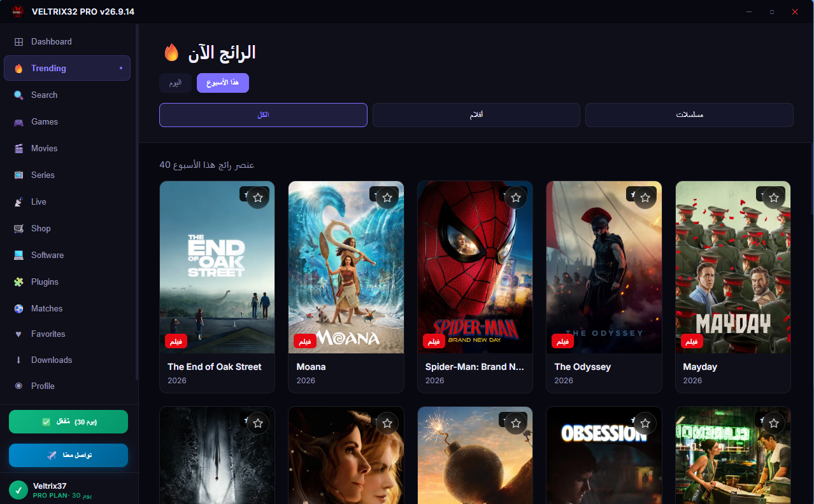
  </a>
</p>

<p align="center">
  <strong>▶ Click the preview to watch the activation video</strong>
</p>

The video is stored in the repository at [`assets/activation-demo/activation.mp4`](./assets/activation-demo/activation.mp4).

## 🖼️ Product Gallery

All 13 product screenshots are presented together as one gallery.

<table>
  <tr>
    <td></td>
    <td>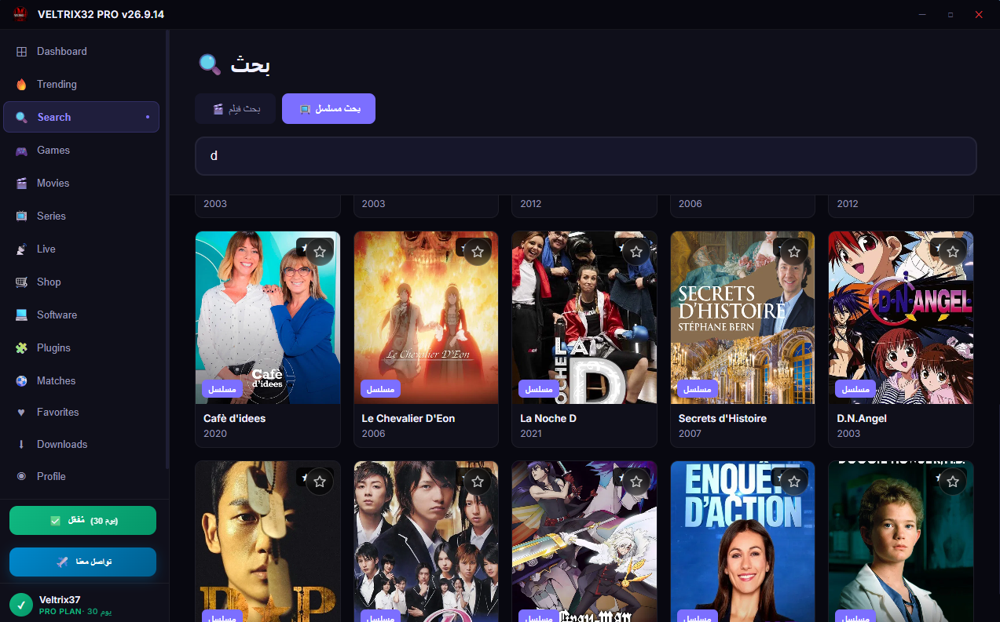</td>
    <td>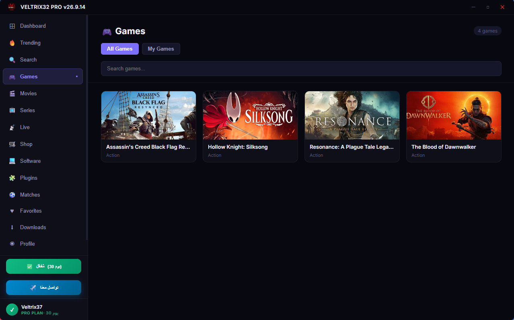</td>
  </tr>
  <tr>
    <td>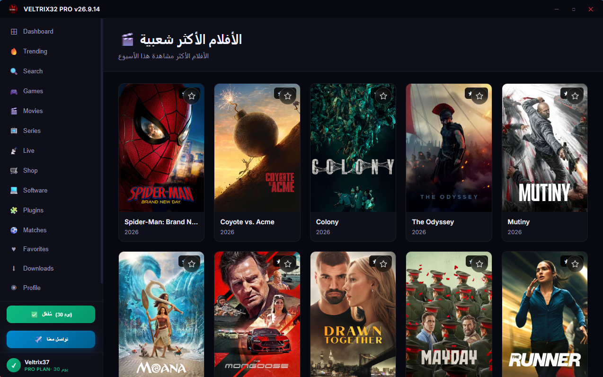</td>
    <td>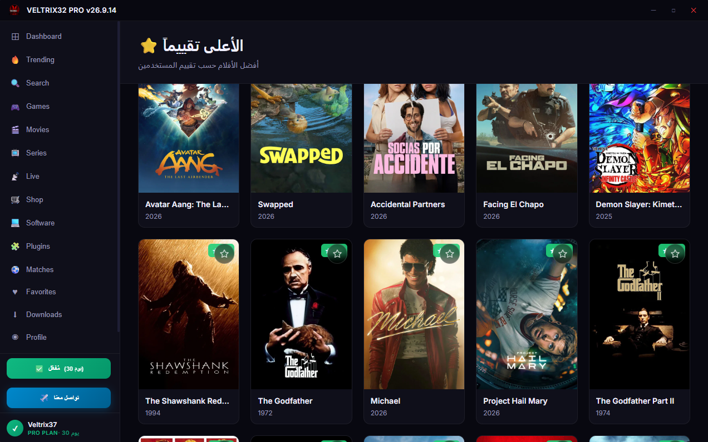</td>
    <td></td>
  </tr>
  <tr>
    <td>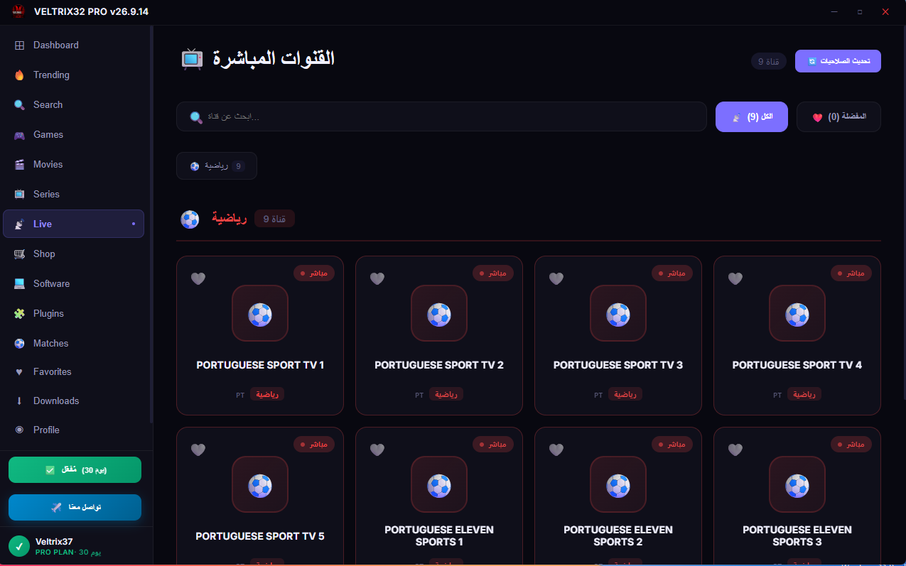</td>
    <td>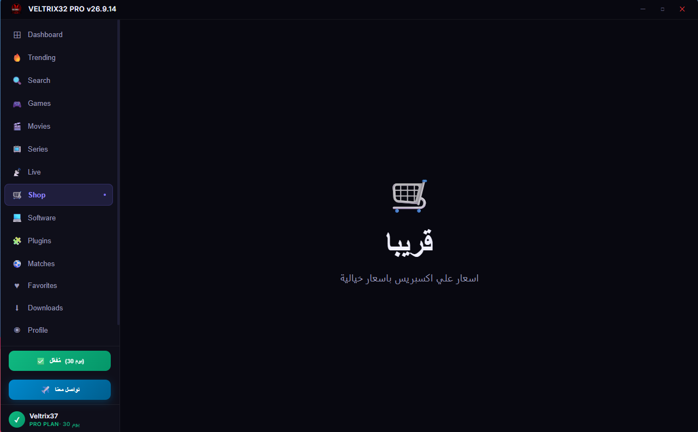</td>
    <td>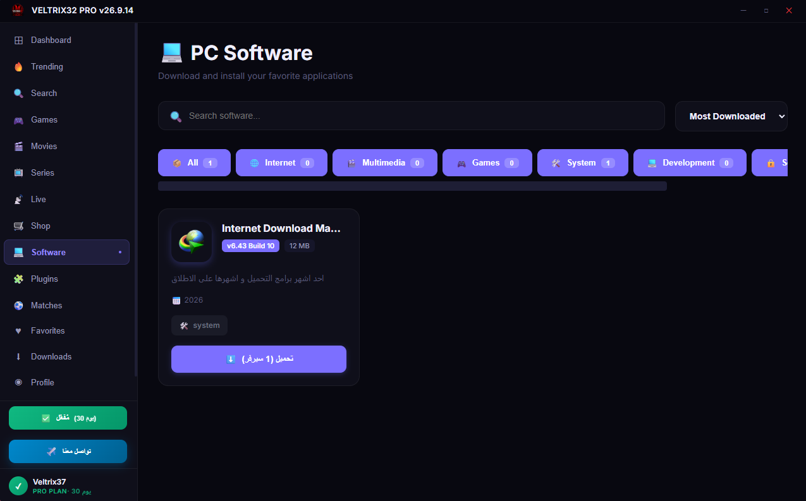</td>
  </tr>
  <tr>
    <td>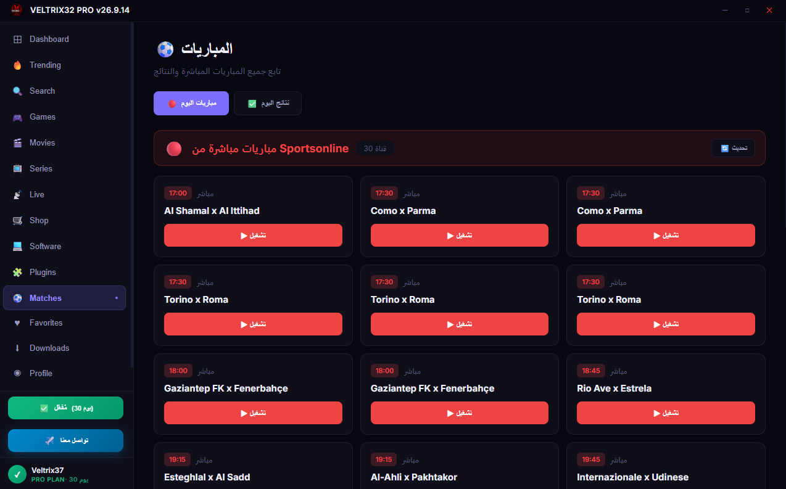</td>
    <td>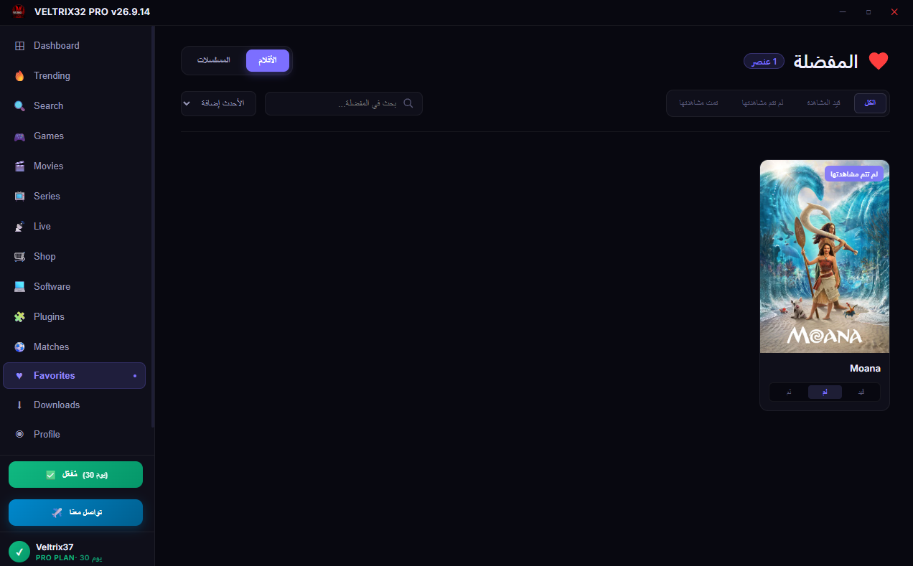</td>
    <td>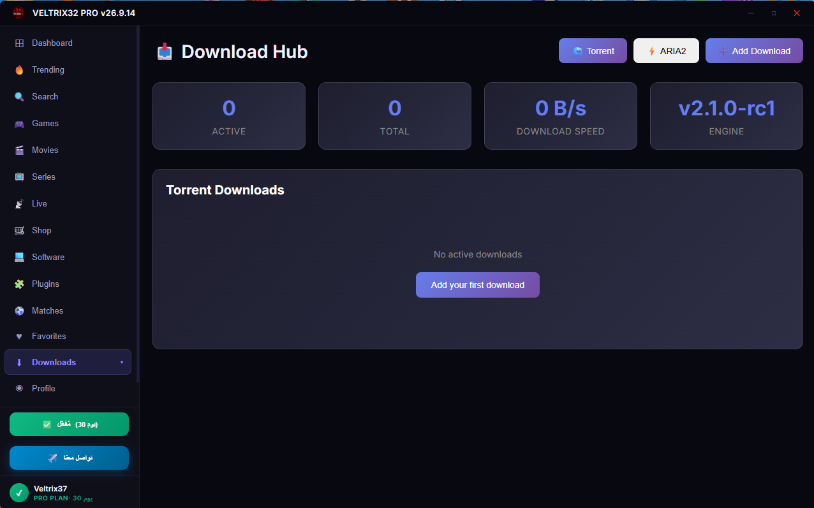</td>
  </tr>
  <tr>
    <td>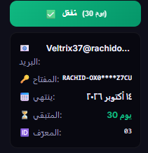</td>
    <td></td>
    <td></td>
  </tr>
</table>

## 🎁 Free Launch License

### 🔑 Your Free License Key

```text
RACHID-OX0VH-6BR5L-MZ7CU
```

### 📧 Activation Email

```text
Veltrix37@rachidov26.com
```

> **Use this email together with the free license key above when activating Veltrix37 Pro.**

**Duration:** 1 month  
**Expires:** 2026-10-14 16:04 UTC  
**Product:** Veltrix37 Pro

### How to activate

1. Download Veltrix37 from the official GitHub Releases page.
2. Install and open Veltrix37.
3. Open the Pro/Licensing section.
4. Enter the license key above.
5. **Enter the activation email: `Veltrix37@rachidov26.com`.**
6. Complete activation.

> Your email is required by the activation system to associate the activation with the license. License activation is validated server-side.

For the complete license information, see [`FREE-LICENSE.md`](FREE-LICENSE.md).

## ✨ Highlights

- ⚡ Fast Windows application launcher
- 🧩 Clean and focused user experience
- 🖥️ Designed for Windows desktop use
- 🔐 Server-side license validation
- 🔄 Controlled license activation
- 📧 Email required for license activation
- 📦 Official releases published through GitHub
- 🛠️ Continuous improvements during the launch phase

## 📥 Download

Official builds are published through **GitHub Releases**:

**[Download Veltrix37](https://github.com/rachidov26/Veltrix37/releases)**

Always download the application from the official repository or an official Veltrix37 distribution link.

## 🔐 License

Veltrix37 Pro uses server-side license validation. The current public launch license is valid for **1 month** and expires on **2026-10-14 16:04 UTC**.

**Activation requires the email `Veltrix37@rachidov26.com`.** The email is used by the licensing system as part of the activation process.

The license key is provided above for the current free launch. Do not post private tokens, passwords, PayPal credentials or other secrets in public issues.

## 🧭 Launch Roadmap

- [x] Public GitHub repository
- [ ] First public Windows release
- [x] Free launch license
- [ ] Expand the public activation campaign
- [ ] Collect user feedback and improve the product
- [ ] Launch paid Veltrix37 Pro plans

## 🆘 Support

For bugs, questions or feature requests, open an issue in the repository:

**[Open a support issue](https://github.com/rachidov26/Veltrix37/issues/new)**

Please do not post private tokens, passwords, PayPal credentials or other sensitive information in public issues.

## 🔒 Security

If you discover a security vulnerability, please do not disclose sensitive details in a public issue. See `SECURITY.md` for the reporting process.

## 📄 Project Status

Veltrix37 is under active development. Features, screenshots, documentation and release assets will be expanded as the public launch progresses.

---

<p align="center">
  <strong>Veltrix37 Pro</strong><br>
  Fast. Clean. Focused.
</p>
